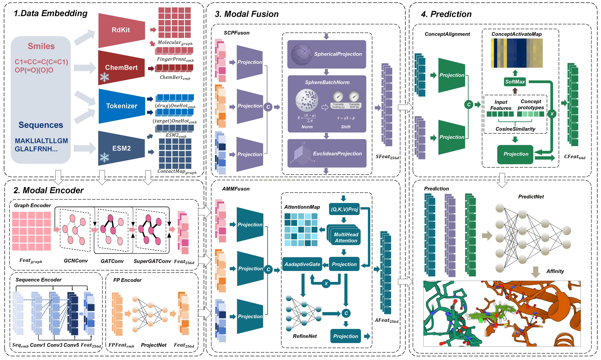

# SCADDTA: Spherical Concept-Aligned Dynamics for Robust and Interpretable Drug-Target Affinity Prediction with Adaptive Multi-Modal Fusion


The SCAD-DTA framework predicts drug-target affinity through four stages: (1) Multi-modal Embedding of graphs, sequences, and fingerprints; (2) Feature Encoding into latent representations; (3) Triple Fusion using AMMFusion (weighting), SCPFusion (geometric alignment), and Concept Alignment (semantic bridging); and (4) Affinity Prediction generating regressed scores and interpretable ConceptMaps.

## Contribution

- Curating Balanced Benchmarks: To remedy the bias inherent in traditional datasets, we derived three large-scale, balanced benchmarks—TTD\_IC50, TTD\_EC50, and TTD\_Ki—from the Therapeutic Target Database.
- Adaptive Cross-Modal Attention: We orchestrate a mechanism that dynamically reweights modality pairs via sample-specific confidence scores. This optimizes fusion precision while curbing the feature interference prevalent in earlier multimodal architectures.
- Spherical Constrained Projection Fusion: Addressing numerical instability, this regularization strategy anchors embeddings onto a unit-sphere manifold. Inspired by structural hierarchy preservation , it effectively shields the model from gradient pathology and feature distortion common in skewed distributions.
- Concept Alignment Module (CAM): We introduce a transparent reasoning tier that maps latent features to learnable biochemical prototypes. This aligns our interpretable decision-making with the latest trends in prototype-guided molecular property prediction .

## Install and Train

```# Clone the repository
git clone https://github.com/xwtxbzz/SCADDTA.git
cd SCADDTA

# Create a virtual environment 
conda create -n scaddta python=3.9
conda activate scaddta

# Install dependencies
pip install -r requirements.txt

# train and test
python train.py
```
